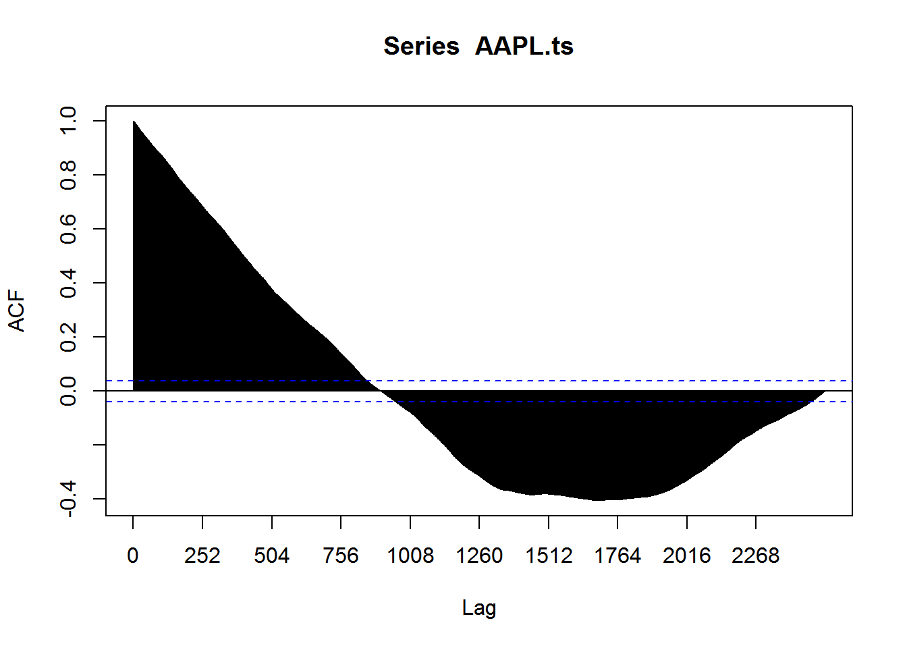

Data Import 

```
## Warning: package 'forecast' was built under R version 3.2.5
```

```
## Loading required package: zoo
```

```
## Warning: package 'zoo' was built under R version 3.2.5
```

```
## 
## Attaching package: 'zoo'
```

```
## The following objects are masked from 'package:base':
## 
##     as.Date, as.Date.numeric
```

```
## Loading required package: timeDate
```

```
## Warning: package 'timeDate' was built under R version 3.2.5
```

```
## This is forecast 7.3
```

```
## Warning: package 'astsa' was built under R version 3.2.5
```

```
## 
## Attaching package: 'astsa'
```

```
## The following object is masked from 'package:forecast':
## 
##     gas
```

```
## Warning: package 'tseries' was built under R version 3.2.5
```

```
##         date  close        volume   open   high    low
## 1      16:00 110.88    59,176,361 109.85 111.32 108.05
## 2 2016/11/09 110.88 59118740.0000 109.88 111.32 108.05
## 3 2016/11/08 111.06 24129630.0000 110.31 111.72 109.70
## 4 2016/11/07 110.41 32361930.0000 110.08 110.51 109.46
## 5 2016/11/04 108.84 30790930.0000 108.53 110.25 108.11
## 6 2016/11/03 109.83 26538700.0000 110.98 111.46 109.55
```

```
##            date   close         volume    open    high     low
## 2514 2006/11/16 12.2300 173424632.0000 12.1243 12.3286 12.0886
## 2515 2006/11/15 12.0071 163255589.0000 12.1507 12.2714 12.0000
## 2516 2006/11/14 12.1429 147220684.0000 12.1143 12.1429 11.9857
## 2517 2006/11/13 12.0500 112638154.0000 11.8886 12.0643 11.8057
## 2518 2006/11/10 11.8743  92336678.0000 11.9357 11.9429 11.7857
## 2519 2006/11/09 11.9057 230712299.0000 11.8443 12.0986 11.7314
```

```
##      date     close    volume      open      high       low 
## "integer"  "double" "integer"  "double"  "double"  "double"
```

```
##         date   close         volume    open    high     low
## 1 2006-11-09 11.9057 230712299.0000 11.8443 12.0986 11.7314
## 2 2006-11-10 11.8743  92336678.0000 11.9357 11.9429 11.7857
## 3 2006-11-13 12.0500 112638154.0000 11.8886 12.0643 11.8057
## 4 2006-11-14 12.1429 147220684.0000 12.1143 12.1429 11.9857
## 5 2006-11-15 12.0071 163255589.0000 12.1507 12.2714 12.0000
## 6 2006-11-16 12.2300 173424632.0000 12.1243 12.3286 12.0886
```

```
##            date  close        volume   open   high    low
## 2514 2016-11-03 109.83 26538700.0000 110.98 111.46 109.55
## 2515 2016-11-04 108.84 30790930.0000 108.53 110.25 108.11
## 2516 2016-11-07 110.41 32361930.0000 110.08 110.51 109.46
## 2517 2016-11-08 111.06 24129630.0000 110.31 111.72 109.70
## 2518 2016-11-09 110.88 59118740.0000 109.88 111.32 108.05
## 2519 2016-11-10 110.88    59,176,361 109.85 111.32 108.05
```

```
## 
## 2006 2007 2008 2009 2010 2011 2012 2013 2014 2015 2016 
##   35  251  253  252  252  252  250  252  252  252  218
```


```
## Time Series:
## Start = c(2006, 217) 
## End = c(2016, 215) 
## Frequency = 252 
##    [1] 2006.857 2006.861 2006.865 2006.869 2006.873 2006.877 2006.881
##    [8] 2006.885 2006.889 2006.893 2006.897 2006.901 2006.905 2006.909
##   [15] 2006.913 2006.917 2006.921 2006.925 2006.929 2006.933 2006.937
##   [22] 2006.940 2006.944 2006.948 2006.952 2006.956 2006.960 2006.964
##   [29] 2006.968 2006.972 2006.976 2006.980 2006.984 2006.988 2006.992
##   [36] 2006.996 2007.000 2007.004 2007.008 2007.012 2007.016 2007.020
##   [43] 2007.024 2007.028 2007.032 2007.036 2007.040 2007.044 2007.048
##   [50] 2007.052 2007.056 2007.060 2007.063 2007.067 2007.071 2007.075
##   [57] 2007.079 2007.083 2007.087 2007.091 2007.095 2007.099 2007.103
##   [64] 2007.107 2007.111 2007.115 2007.119 2007.123 2007.127 2007.131
##   [71] 2007.135 2007.139 2007.143 2007.147 2007.151 2007.155 2007.159
##   [78] 2007.163 2007.167 2007.171 2007.175 2007.179 2007.183 2007.187
##   [85] 2007.190 2007.194 2007.198 2007.202 2007.206 2007.210 2007.214
##   [92] 2007.218 2007.222 2007.226 2007.230 2007.234 2007.238 2007.242
##   [99] 2007.246 2007.250 2007.254 2007.258 2007.262 2007.266 2007.270
##  [106] 2007.274 2007.278 2007.282 2007.286 2007.290 2007.294 2007.298
##  [113] 2007.302 2007.306 2007.310 2007.313 2007.317 2007.321 2007.325
##  [120] 2007.329 2007.333 2007.337 2007.341 2007.345 2007.349 2007.353
##  [127] 2007.357 2007.361 2007.365 2007.369 2007.373 2007.377 2007.381
##  [134] 2007.385 2007.389 2007.393 2007.397 2007.401 2007.405 2007.409
##  [141] 2007.413 2007.417 2007.421 2007.425 2007.429 2007.433 2007.437
##  [148] 2007.440 2007.444 2007.448 2007.452 2007.456 2007.460 2007.464
##  [155] 2007.468 2007.472 2007.476 2007.480 2007.484 2007.488 2007.492
##  [162] 2007.496 2007.500 2007.504 2007.508 2007.512 2007.516 2007.520
##  [169] 2007.524 2007.528 2007.532 2007.536 2007.540 2007.544 2007.548
##  [176] 2007.552 2007.556 2007.560 2007.563 2007.567 2007.571 2007.575
##  [183] 2007.579 2007.583 2007.587 2007.591 2007.595 2007.599 2007.603
##  [190] 2007.607 2007.611 2007.615 2007.619 2007.623 2007.627 2007.631
##  [197] 2007.635 2007.639 2007.643 2007.647 2007.651 2007.655 2007.659
##  [204] 2007.663 2007.667 2007.671 2007.675 2007.679 2007.683 2007.687
##  [211] 2007.690 2007.694 2007.698 2007.702 2007.706 2007.710 2007.714
##  [218] 2007.718 2007.722 2007.726 2007.730 2007.734 2007.738 2007.742
##  [225] 2007.746 2007.750 2007.754 2007.758 2007.762 2007.766 2007.770
##  [232] 2007.774 2007.778 2007.782 2007.786 2007.790 2007.794 2007.798
##  [239] 2007.802 2007.806 2007.810 2007.813 2007.817 2007.821 2007.825
##  [246] 2007.829 2007.833 2007.837 2007.841 2007.845 2007.849 2007.853
##  [253] 2007.857 2007.861 2007.865 2007.869 2007.873 2007.877 2007.881
##  [260] 2007.885 2007.889 2007.893 2007.897 2007.901 2007.905 2007.909
##  [267] 2007.913 2007.917 2007.921 2007.925 2007.929 2007.933 2007.937
##  [274] 2007.940 2007.944 2007.948 2007.952 2007.956 2007.960 2007.964
##  [281] 2007.968 2007.972 2007.976 2007.980 2007.984 2007.988 2007.992
##  [288] 2007.996 2008.000 2008.004 2008.008 2008.012 2008.016 2008.020
##  [295] 2008.024 2008.028 2008.032 2008.036 2008.040 2008.044 2008.048
##  [302] 2008.052 2008.056 2008.060 2008.063 2008.067 2008.071 2008.075
##  [309] 2008.079 2008.083 2008.087 2008.091 2008.095 2008.099 2008.103
##  [316] 2008.107 2008.111 2008.115 2008.119 2008.123 2008.127 2008.131
##  [323] 2008.135 2008.139 2008.143 2008.147 2008.151 2008.155 2008.159
##  [330] 2008.163 2008.167 2008.171 2008.175 2008.179 2008.183 2008.187
##  [337] 2008.190 2008.194 2008.198 2008.202 2008.206 2008.210 2008.214
##  [344] 2008.218 2008.222 2008.226 2008.230 2008.234 2008.238 2008.242
##  [351] 2008.246 2008.250 2008.254 2008.258 2008.262 2008.266 2008.270
##  [358] 2008.274 2008.278 2008.282 2008.286 2008.290 2008.294 2008.298
##  [365] 2008.302 2008.306 2008.310 2008.313 2008.317 2008.321 2008.325
##  [372] 2008.329 2008.333 2008.337 2008.341 2008.345 2008.349 2008.353
##  [379] 2008.357 2008.361 2008.365 2008.369 2008.373 2008.377 2008.381
##  [386] 2008.385 2008.389 2008.393 2008.397 2008.401 2008.405 2008.409
##  [393] 2008.413 2008.417 2008.421 2008.425 2008.429 2008.433 2008.437
##  [400] 2008.440 2008.444 2008.448 2008.452 2008.456 2008.460 2008.464
##  [407] 2008.468 2008.472 2008.476 2008.480 2008.484 2008.488 2008.492
##  [414] 2008.496 2008.500 2008.504 2008.508 2008.512 2008.516 2008.520
##  [421] 2008.524 2008.528 2008.532 2008.536 2008.540 2008.544 2008.548
##  [428] 2008.552 2008.556 2008.560 2008.563 2008.567 2008.571 2008.575
##  [435] 2008.579 2008.583 2008.587 2008.591 2008.595 2008.599 2008.603
##  [442] 2008.607 2008.611 2008.615 2008.619 2008.623 2008.627 2008.631
##  [449] 2008.635 2008.639 2008.643 2008.647 2008.651 2008.655 2008.659
##  [456] 2008.663 2008.667 2008.671 2008.675 2008.679 2008.683 2008.687
##  [463] 2008.690 2008.694 2008.698 2008.702 2008.706 2008.710 2008.714
##  [470] 2008.718 2008.722 2008.726 2008.730 2008.734 2008.738 2008.742
##  [477] 2008.746 2008.750 2008.754 2008.758 2008.762 2008.766 2008.770
##  [484] 2008.774 2008.778 2008.782 2008.786 2008.790 2008.794 2008.798
##  [491] 2008.802 2008.806 2008.810 2008.813 2008.817 2008.821 2008.825
##  [498] 2008.829 2008.833 2008.837 2008.841 2008.845 2008.849 2008.853
##  [505] 2008.857 2008.861 2008.865 2008.869 2008.873 2008.877 2008.881
##  [512] 2008.885 2008.889 2008.893 2008.897 2008.901 2008.905 2008.909
##  [519] 2008.913 2008.917 2008.921 2008.925 2008.929 2008.933 2008.937
##  [526] 2008.940 2008.944 2008.948 2008.952 2008.956 2008.960 2008.964
##  [533] 2008.968 2008.972 2008.976 2008.980 2008.984 2008.988 2008.992
##  [540] 2008.996 2009.000 2009.004 2009.008 2009.012 2009.016 2009.020
##  [547] 2009.024 2009.028 2009.032 2009.036 2009.040 2009.044 2009.048
##  [554] 2009.052 2009.056 2009.060 2009.063 2009.067 2009.071 2009.075
##  [561] 2009.079 2009.083 2009.087 2009.091 2009.095 2009.099 2009.103
##  [568] 2009.107 2009.111 2009.115 2009.119 2009.123 2009.127 2009.131
##  [575] 2009.135 2009.139 2009.143 2009.147 2009.151 2009.155 2009.159
##  [582] 2009.163 2009.167 2009.171 2009.175 2009.179 2009.183 2009.187
##  [589] 2009.190 2009.194 2009.198 2009.202 2009.206 2009.210 2009.214
##  [596] 2009.218 2009.222 2009.226 2009.230 2009.234 2009.238 2009.242
##  [603] 2009.246 2009.250 2009.254 2009.258 2009.262 2009.266 2009.270
##  [610] 2009.274 2009.278 2009.282 2009.286 2009.290 2009.294 2009.298
##  [617] 2009.302 2009.306 2009.310 2009.313 2009.317 2009.321 2009.325
##  [624] 2009.329 2009.333 2009.337 2009.341 2009.345 2009.349 2009.353
##  [631] 2009.357 2009.361 2009.365 2009.369 2009.373 2009.377 2009.381
##  [638] 2009.385 2009.389 2009.393 2009.397 2009.401 2009.405 2009.409
##  [645] 2009.413 2009.417 2009.421 2009.425 2009.429 2009.433 2009.437
##  [652] 2009.440 2009.444 2009.448 2009.452 2009.456 2009.460 2009.464
##  [659] 2009.468 2009.472 2009.476 2009.480 2009.484 2009.488 2009.492
##  [666] 2009.496 2009.500 2009.504 2009.508 2009.512 2009.516 2009.520
##  [673] 2009.524 2009.528 2009.532 2009.536 2009.540 2009.544 2009.548
##  [680] 2009.552 2009.556 2009.560 2009.563 2009.567 2009.571 2009.575
##  [687] 2009.579 2009.583 2009.587 2009.591 2009.595 2009.599 2009.603
##  [694] 2009.607 2009.611 2009.615 2009.619 2009.623 2009.627 2009.631
##  [701] 2009.635 2009.639 2009.643 2009.647 2009.651 2009.655 2009.659
##  [708] 2009.663 2009.667 2009.671 2009.675 2009.679 2009.683 2009.687
##  [715] 2009.690 2009.694 2009.698 2009.702 2009.706 2009.710 2009.714
##  [722] 2009.718 2009.722 2009.726 2009.730 2009.734 2009.738 2009.742
##  [729] 2009.746 2009.750 2009.754 2009.758 2009.762 2009.766 2009.770
##  [736] 2009.774 2009.778 2009.782 2009.786 2009.790 2009.794 2009.798
##  [743] 2009.802 2009.806 2009.810 2009.813 2009.817 2009.821 2009.825
##  [750] 2009.829 2009.833 2009.837 2009.841 2009.845 2009.849 2009.853
##  [757] 2009.857 2009.861 2009.865 2009.869 2009.873 2009.877 2009.881
##  [764] 2009.885 2009.889 2009.893 2009.897 2009.901 2009.905 2009.909
##  [771] 2009.913 2009.917 2009.921 2009.925 2009.929 2009.933 2009.937
##  [778] 2009.940 2009.944 2009.948 2009.952 2009.956 2009.960 2009.964
##  [785] 2009.968 2009.972 2009.976 2009.980 2009.984 2009.988 2009.992
##  [792] 2009.996 2010.000 2010.004 2010.008 2010.012 2010.016 2010.020
##  [799] 2010.024 2010.028 2010.032 2010.036 2010.040 2010.044 2010.048
##  [806] 2010.052 2010.056 2010.060 2010.063 2010.067 2010.071 2010.075
##  [813] 2010.079 2010.083 2010.087 2010.091 2010.095 2010.099 2010.103
##  [820] 2010.107 2010.111 2010.115 2010.119 2010.123 2010.127 2010.131
##  [827] 2010.135 2010.139 2010.143 2010.147 2010.151 2010.155 2010.159
##  [834] 2010.163 2010.167 2010.171 2010.175 2010.179 2010.183 2010.187
##  [841] 2010.190 2010.194 2010.198 2010.202 2010.206 2010.210 2010.214
##  [848] 2010.218 2010.222 2010.226 2010.230 2010.234 2010.238 2010.242
##  [855] 2010.246 2010.250 2010.254 2010.258 2010.262 2010.266 2010.270
##  [862] 2010.274 2010.278 2010.282 2010.286 2010.290 2010.294 2010.298
##  [869] 2010.302 2010.306 2010.310 2010.313 2010.317 2010.321 2010.325
##  [876] 2010.329 2010.333 2010.337 2010.341 2010.345 2010.349 2010.353
##  [883] 2010.357 2010.361 2010.365 2010.369 2010.373 2010.377 2010.381
##  [890] 2010.385 2010.389 2010.393 2010.397 2010.401 2010.405 2010.409
##  [897] 2010.413 2010.417 2010.421 2010.425 2010.429 2010.433 2010.437
##  [904] 2010.440 2010.444 2010.448 2010.452 2010.456 2010.460 2010.464
##  [911] 2010.468 2010.472 2010.476 2010.480 2010.484 2010.488 2010.492
##  [918] 2010.496 2010.500 2010.504 2010.508 2010.512 2010.516 2010.520
##  [925] 2010.524 2010.528 2010.532 2010.536 2010.540 2010.544 2010.548
##  [932] 2010.552 2010.556 2010.560 2010.563 2010.567 2010.571 2010.575
##  [939] 2010.579 2010.583 2010.587 2010.591 2010.595 2010.599 2010.603
##  [946] 2010.607 2010.611 2010.615 2010.619 2010.623 2010.627 2010.631
##  [953] 2010.635 2010.639 2010.643 2010.647 2010.651 2010.655 2010.659
##  [960] 2010.663 2010.667 2010.671 2010.675 2010.679 2010.683 2010.687
##  [967] 2010.690 2010.694 2010.698 2010.702 2010.706 2010.710 2010.714
##  [974] 2010.718 2010.722 2010.726 2010.730 2010.734 2010.738 2010.742
##  [981] 2010.746 2010.750 2010.754 2010.758 2010.762 2010.766 2010.770
##  [988] 2010.774 2010.778 2010.782 2010.786 2010.790 2010.794 2010.798
##  [995] 2010.802 2010.806 2010.810 2010.813 2010.817 2010.821 2010.825
## [1002] 2010.829 2010.833 2010.837 2010.841 2010.845 2010.849 2010.853
## [1009] 2010.857 2010.861 2010.865 2010.869 2010.873 2010.877 2010.881
## [1016] 2010.885 2010.889 2010.893 2010.897 2010.901 2010.905 2010.909
## [1023] 2010.913 2010.917 2010.921 2010.925 2010.929 2010.933 2010.937
## [1030] 2010.940 2010.944 2010.948 2010.952 2010.956 2010.960 2010.964
## [1037] 2010.968 2010.972 2010.976 2010.980 2010.984 2010.988 2010.992
## [1044] 2010.996 2011.000 2011.004 2011.008 2011.012 2011.016 2011.020
## [1051] 2011.024 2011.028 2011.032 2011.036 2011.040 2011.044 2011.048
## [1058] 2011.052 2011.056 2011.060 2011.063 2011.067 2011.071 2011.075
## [1065] 2011.079 2011.083 2011.087 2011.091 2011.095 2011.099 2011.103
## [1072] 2011.107 2011.111 2011.115 2011.119 2011.123 2011.127 2011.131
## [1079] 2011.135 2011.139 2011.143 2011.147 2011.151 2011.155 2011.159
## [1086] 2011.163 2011.167 2011.171 2011.175 2011.179 2011.183 2011.187
## [1093] 2011.190 2011.194 2011.198 2011.202 2011.206 2011.210 2011.214
## [1100] 2011.218 2011.222 2011.226 2011.230 2011.234 2011.238 2011.242
## [1107] 2011.246 2011.250 2011.254 2011.258 2011.262 2011.266 2011.270
## [1114] 2011.274 2011.278 2011.282 2011.286 2011.290 2011.294 2011.298
## [1121] 2011.302 2011.306 2011.310 2011.313 2011.317 2011.321 2011.325
## [1128] 2011.329 2011.333 2011.337 2011.341 2011.345 2011.349 2011.353
## [1135] 2011.357 2011.361 2011.365 2011.369 2011.373 2011.377 2011.381
## [1142] 2011.385 2011.389 2011.393 2011.397 2011.401 2011.405 2011.409
## [1149] 2011.413 2011.417 2011.421 2011.425 2011.429 2011.433 2011.437
## [1156] 2011.440 2011.444 2011.448 2011.452 2011.456 2011.460 2011.464
## [1163] 2011.468 2011.472 2011.476 2011.480 2011.484 2011.488 2011.492
## [1170] 2011.496 2011.500 2011.504 2011.508 2011.512 2011.516 2011.520
## [1177] 2011.524 2011.528 2011.532 2011.536 2011.540 2011.544 2011.548
## [1184] 2011.552 2011.556 2011.560 2011.563 2011.567 2011.571 2011.575
## [1191] 2011.579 2011.583 2011.587 2011.591 2011.595 2011.599 2011.603
## [1198] 2011.607 2011.611 2011.615 2011.619 2011.623 2011.627 2011.631
## [1205] 2011.635 2011.639 2011.643 2011.647 2011.651 2011.655 2011.659
## [1212] 2011.663 2011.667 2011.671 2011.675 2011.679 2011.683 2011.687
## [1219] 2011.690 2011.694 2011.698 2011.702 2011.706 2011.710 2011.714
## [1226] 2011.718 2011.722 2011.726 2011.730 2011.734 2011.738 2011.742
## [1233] 2011.746 2011.750 2011.754 2011.758 2011.762 2011.766 2011.770
## [1240] 2011.774 2011.778 2011.782 2011.786 2011.790 2011.794 2011.798
## [1247] 2011.802 2011.806 2011.810 2011.813 2011.817 2011.821 2011.825
## [1254] 2011.829 2011.833 2011.837 2011.841 2011.845 2011.849 2011.853
## [1261] 2011.857 2011.861 2011.865 2011.869 2011.873 2011.877 2011.881
## [1268] 2011.885 2011.889 2011.893 2011.897 2011.901 2011.905 2011.909
## [1275] 2011.913 2011.917 2011.921 2011.925 2011.929 2011.933 2011.937
## [1282] 2011.940 2011.944 2011.948 2011.952 2011.956 2011.960 2011.964
## [1289] 2011.968 2011.972 2011.976 2011.980 2011.984 2011.988 2011.992
## [1296] 2011.996 2012.000 2012.004 2012.008 2012.012 2012.016 2012.020
## [1303] 2012.024 2012.028 2012.032 2012.036 2012.040 2012.044 2012.048
## [1310] 2012.052 2012.056 2012.060 2012.063 2012.067 2012.071 2012.075
## [1317] 2012.079 2012.083 2012.087 2012.091 2012.095 2012.099 2012.103
## [1324] 2012.107 2012.111 2012.115 2012.119 2012.123 2012.127 2012.131
## [1331] 2012.135 2012.139 2012.143 2012.147 2012.151 2012.155 2012.159
## [1338] 2012.163 2012.167 2012.171 2012.175 2012.179 2012.183 2012.187
## [1345] 2012.190 2012.194 2012.198 2012.202 2012.206 2012.210 2012.214
## [1352] 2012.218 2012.222 2012.226 2012.230 2012.234 2012.238 2012.242
## [1359] 2012.246 2012.250 2012.254 2012.258 2012.262 2012.266 2012.270
## [1366] 2012.274 2012.278 2012.282 2012.286 2012.290 2012.294 2012.298
## [1373] 2012.302 2012.306 2012.310 2012.313 2012.317 2012.321 2012.325
## [1380] 2012.329 2012.333 2012.337 2012.341 2012.345 2012.349 2012.353
## [1387] 2012.357 2012.361 2012.365 2012.369 2012.373 2012.377 2012.381
## [1394] 2012.385 2012.389 2012.393 2012.397 2012.401 2012.405 2012.409
## [1401] 2012.413 2012.417 2012.421 2012.425 2012.429 2012.433 2012.437
## [1408] 2012.440 2012.444 2012.448 2012.452 2012.456 2012.460 2012.464
## [1415] 2012.468 2012.472 2012.476 2012.480 2012.484 2012.488 2012.492
## [1422] 2012.496 2012.500 2012.504 2012.508 2012.512 2012.516 2012.520
## [1429] 2012.524 2012.528 2012.532 2012.536 2012.540 2012.544 2012.548
## [1436] 2012.552 2012.556 2012.560 2012.563 2012.567 2012.571 2012.575
## [1443] 2012.579 2012.583 2012.587 2012.591 2012.595 2012.599 2012.603
## [1450] 2012.607 2012.611 2012.615 2012.619 2012.623 2012.627 2012.631
## [1457] 2012.635 2012.639 2012.643 2012.647 2012.651 2012.655 2012.659
## [1464] 2012.663 2012.667 2012.671 2012.675 2012.679 2012.683 2012.687
## [1471] 2012.690 2012.694 2012.698 2012.702 2012.706 2012.710 2012.714
## [1478] 2012.718 2012.722 2012.726 2012.730 2012.734 2012.738 2012.742
## [1485] 2012.746 2012.750 2012.754 2012.758 2012.762 2012.766 2012.770
## [1492] 2012.774 2012.778 2012.782 2012.786 2012.790 2012.794 2012.798
## [1499] 2012.802 2012.806 2012.810 2012.813 2012.817 2012.821 2012.825
## [1506] 2012.829 2012.833 2012.837 2012.841 2012.845 2012.849 2012.853
## [1513] 2012.857 2012.861 2012.865 2012.869 2012.873 2012.877 2012.881
## [1520] 2012.885 2012.889 2012.893 2012.897 2012.901 2012.905 2012.909
## [1527] 2012.913 2012.917 2012.921 2012.925 2012.929 2012.933 2012.937
## [1534] 2012.940 2012.944 2012.948 2012.952 2012.956 2012.960 2012.964
## [1541] 2012.968 2012.972 2012.976 2012.980 2012.984 2012.988 2012.992
## [1548] 2012.996 2013.000 2013.004 2013.008 2013.012 2013.016 2013.020
## [1555] 2013.024 2013.028 2013.032 2013.036 2013.040 2013.044 2013.048
## [1562] 2013.052 2013.056 2013.060 2013.063 2013.067 2013.071 2013.075
## [1569] 2013.079 2013.083 2013.087 2013.091 2013.095 2013.099 2013.103
## [1576] 2013.107 2013.111 2013.115 2013.119 2013.123 2013.127 2013.131
## [1583] 2013.135 2013.139 2013.143 2013.147 2013.151 2013.155 2013.159
## [1590] 2013.163 2013.167 2013.171 2013.175 2013.179 2013.183 2013.187
## [1597] 2013.190 2013.194 2013.198 2013.202 2013.206 2013.210 2013.214
## [1604] 2013.218 2013.222 2013.226 2013.230 2013.234 2013.238 2013.242
## [1611] 2013.246 2013.250 2013.254 2013.258 2013.262 2013.266 2013.270
## [1618] 2013.274 2013.278 2013.282 2013.286 2013.290 2013.294 2013.298
## [1625] 2013.302 2013.306 2013.310 2013.313 2013.317 2013.321 2013.325
## [1632] 2013.329 2013.333 2013.337 2013.341 2013.345 2013.349 2013.353
## [1639] 2013.357 2013.361 2013.365 2013.369 2013.373 2013.377 2013.381
## [1646] 2013.385 2013.389 2013.393 2013.397 2013.401 2013.405 2013.409
## [1653] 2013.413 2013.417 2013.421 2013.425 2013.429 2013.433 2013.437
## [1660] 2013.440 2013.444 2013.448 2013.452 2013.456 2013.460 2013.464
## [1667] 2013.468 2013.472 2013.476 2013.480 2013.484 2013.488 2013.492
## [1674] 2013.496 2013.500 2013.504 2013.508 2013.512 2013.516 2013.520
## [1681] 2013.524 2013.528 2013.532 2013.536 2013.540 2013.544 2013.548
## [1688] 2013.552 2013.556 2013.560 2013.563 2013.567 2013.571 2013.575
## [1695] 2013.579 2013.583 2013.587 2013.591 2013.595 2013.599 2013.603
## [1702] 2013.607 2013.611 2013.615 2013.619 2013.623 2013.627 2013.631
## [1709] 2013.635 2013.639 2013.643 2013.647 2013.651 2013.655 2013.659
## [1716] 2013.663 2013.667 2013.671 2013.675 2013.679 2013.683 2013.687
## [1723] 2013.690 2013.694 2013.698 2013.702 2013.706 2013.710 2013.714
## [1730] 2013.718 2013.722 2013.726 2013.730 2013.734 2013.738 2013.742
## [1737] 2013.746 2013.750 2013.754 2013.758 2013.762 2013.766 2013.770
## [1744] 2013.774 2013.778 2013.782 2013.786 2013.790 2013.794 2013.798
## [1751] 2013.802 2013.806 2013.810 2013.813 2013.817 2013.821 2013.825
## [1758] 2013.829 2013.833 2013.837 2013.841 2013.845 2013.849 2013.853
## [1765] 2013.857 2013.861 2013.865 2013.869 2013.873 2013.877 2013.881
## [1772] 2013.885 2013.889 2013.893 2013.897 2013.901 2013.905 2013.909
## [1779] 2013.913 2013.917 2013.921 2013.925 2013.929 2013.933 2013.937
## [1786] 2013.940 2013.944 2013.948 2013.952 2013.956 2013.960 2013.964
## [1793] 2013.968 2013.972 2013.976 2013.980 2013.984 2013.988 2013.992
## [1800] 2013.996 2014.000 2014.004 2014.008 2014.012 2014.016 2014.020
## [1807] 2014.024 2014.028 2014.032 2014.036 2014.040 2014.044 2014.048
## [1814] 2014.052 2014.056 2014.060 2014.063 2014.067 2014.071 2014.075
## [1821] 2014.079 2014.083 2014.087 2014.091 2014.095 2014.099 2014.103
## [1828] 2014.107 2014.111 2014.115 2014.119 2014.123 2014.127 2014.131
## [1835] 2014.135 2014.139 2014.143 2014.147 2014.151 2014.155 2014.159
## [1842] 2014.163 2014.167 2014.171 2014.175 2014.179 2014.183 2014.187
## [1849] 2014.190 2014.194 2014.198 2014.202 2014.206 2014.210 2014.214
## [1856] 2014.218 2014.222 2014.226 2014.230 2014.234 2014.238 2014.242
## [1863] 2014.246 2014.250 2014.254 2014.258 2014.262 2014.266 2014.270
## [1870] 2014.274 2014.278 2014.282 2014.286 2014.290 2014.294 2014.298
## [1877] 2014.302 2014.306 2014.310 2014.313 2014.317 2014.321 2014.325
## [1884] 2014.329 2014.333 2014.337 2014.341 2014.345 2014.349 2014.353
## [1891] 2014.357 2014.361 2014.365 2014.369 2014.373 2014.377 2014.381
## [1898] 2014.385 2014.389 2014.393 2014.397 2014.401 2014.405 2014.409
## [1905] 2014.413 2014.417 2014.421 2014.425 2014.429 2014.433 2014.437
## [1912] 2014.440 2014.444 2014.448 2014.452 2014.456 2014.460 2014.464
## [1919] 2014.468 2014.472 2014.476 2014.480 2014.484 2014.488 2014.492
## [1926] 2014.496 2014.500 2014.504 2014.508 2014.512 2014.516 2014.520
## [1933] 2014.524 2014.528 2014.532 2014.536 2014.540 2014.544 2014.548
## [1940] 2014.552 2014.556 2014.560 2014.563 2014.567 2014.571 2014.575
## [1947] 2014.579 2014.583 2014.587 2014.591 2014.595 2014.599 2014.603
## [1954] 2014.607 2014.611 2014.615 2014.619 2014.623 2014.627 2014.631
## [1961] 2014.635 2014.639 2014.643 2014.647 2014.651 2014.655 2014.659
## [1968] 2014.663 2014.667 2014.671 2014.675 2014.679 2014.683 2014.687
## [1975] 2014.690 2014.694 2014.698 2014.702 2014.706 2014.710 2014.714
## [1982] 2014.718 2014.722 2014.726 2014.730 2014.734 2014.738 2014.742
## [1989] 2014.746 2014.750 2014.754 2014.758 2014.762 2014.766 2014.770
## [1996] 2014.774 2014.778 2014.782 2014.786 2014.790 2014.794 2014.798
## [2003] 2014.802 2014.806 2014.810 2014.813 2014.817 2014.821 2014.825
## [2010] 2014.829 2014.833 2014.837 2014.841 2014.845 2014.849 2014.853
## [2017] 2014.857 2014.861 2014.865 2014.869 2014.873 2014.877 2014.881
## [2024] 2014.885 2014.889 2014.893 2014.897 2014.901 2014.905 2014.909
## [2031] 2014.913 2014.917 2014.921 2014.925 2014.929 2014.933 2014.937
## [2038] 2014.940 2014.944 2014.948 2014.952 2014.956 2014.960 2014.964
## [2045] 2014.968 2014.972 2014.976 2014.980 2014.984 2014.988 2014.992
## [2052] 2014.996 2015.000 2015.004 2015.008 2015.012 2015.016 2015.020
## [2059] 2015.024 2015.028 2015.032 2015.036 2015.040 2015.044 2015.048
## [2066] 2015.052 2015.056 2015.060 2015.063 2015.067 2015.071 2015.075
## [2073] 2015.079 2015.083 2015.087 2015.091 2015.095 2015.099 2015.103
## [2080] 2015.107 2015.111 2015.115 2015.119 2015.123 2015.127 2015.131
## [2087] 2015.135 2015.139 2015.143 2015.147 2015.151 2015.155 2015.159
## [2094] 2015.163 2015.167 2015.171 2015.175 2015.179 2015.183 2015.187
## [2101] 2015.190 2015.194 2015.198 2015.202 2015.206 2015.210 2015.214
## [2108] 2015.218 2015.222 2015.226 2015.230 2015.234 2015.238 2015.242
## [2115] 2015.246 2015.250 2015.254 2015.258 2015.262 2015.266 2015.270
## [2122] 2015.274 2015.278 2015.282 2015.286 2015.290 2015.294 2015.298
## [2129] 2015.302 2015.306 2015.310 2015.313 2015.317 2015.321 2015.325
## [2136] 2015.329 2015.333 2015.337 2015.341 2015.345 2015.349 2015.353
## [2143] 2015.357 2015.361 2015.365 2015.369 2015.373 2015.377 2015.381
## [2150] 2015.385 2015.389 2015.393 2015.397 2015.401 2015.405 2015.409
## [2157] 2015.413 2015.417 2015.421 2015.425 2015.429 2015.433 2015.437
## [2164] 2015.440 2015.444 2015.448 2015.452 2015.456 2015.460 2015.464
## [2171] 2015.468 2015.472 2015.476 2015.480 2015.484 2015.488 2015.492
## [2178] 2015.496 2015.500 2015.504 2015.508 2015.512 2015.516 2015.520
## [2185] 2015.524 2015.528 2015.532 2015.536 2015.540 2015.544 2015.548
## [2192] 2015.552 2015.556 2015.560 2015.563 2015.567 2015.571 2015.575
## [2199] 2015.579 2015.583 2015.587 2015.591 2015.595 2015.599 2015.603
## [2206] 2015.607 2015.611 2015.615 2015.619 2015.623 2015.627 2015.631
## [2213] 2015.635 2015.639 2015.643 2015.647 2015.651 2015.655 2015.659
## [2220] 2015.663 2015.667 2015.671 2015.675 2015.679 2015.683 2015.687
## [2227] 2015.690 2015.694 2015.698 2015.702 2015.706 2015.710 2015.714
## [2234] 2015.718 2015.722 2015.726 2015.730 2015.734 2015.738 2015.742
## [2241] 2015.746 2015.750 2015.754 2015.758 2015.762 2015.766 2015.770
## [2248] 2015.774 2015.778 2015.782 2015.786 2015.790 2015.794 2015.798
## [2255] 2015.802 2015.806 2015.810 2015.813 2015.817 2015.821 2015.825
## [2262] 2015.829 2015.833 2015.837 2015.841 2015.845 2015.849 2015.853
## [2269] 2015.857 2015.861 2015.865 2015.869 2015.873 2015.877 2015.881
## [2276] 2015.885 2015.889 2015.893 2015.897 2015.901 2015.905 2015.909
## [2283] 2015.913 2015.917 2015.921 2015.925 2015.929 2015.933 2015.937
## [2290] 2015.940 2015.944 2015.948 2015.952 2015.956 2015.960 2015.964
## [2297] 2015.968 2015.972 2015.976 2015.980 2015.984 2015.988 2015.992
## [2304] 2015.996 2016.000 2016.004 2016.008 2016.012 2016.016 2016.020
## [2311] 2016.024 2016.028 2016.032 2016.036 2016.040 2016.044 2016.048
## [2318] 2016.052 2016.056 2016.060 2016.063 2016.067 2016.071 2016.075
## [2325] 2016.079 2016.083 2016.087 2016.091 2016.095 2016.099 2016.103
## [2332] 2016.107 2016.111 2016.115 2016.119 2016.123 2016.127 2016.131
## [2339] 2016.135 2016.139 2016.143 2016.147 2016.151 2016.155 2016.159
## [2346] 2016.163 2016.167 2016.171 2016.175 2016.179 2016.183 2016.187
## [2353] 2016.190 2016.194 2016.198 2016.202 2016.206 2016.210 2016.214
## [2360] 2016.218 2016.222 2016.226 2016.230 2016.234 2016.238 2016.242
## [2367] 2016.246 2016.250 2016.254 2016.258 2016.262 2016.266 2016.270
## [2374] 2016.274 2016.278 2016.282 2016.286 2016.290 2016.294 2016.298
## [2381] 2016.302 2016.306 2016.310 2016.313 2016.317 2016.321 2016.325
## [2388] 2016.329 2016.333 2016.337 2016.341 2016.345 2016.349 2016.353
## [2395] 2016.357 2016.361 2016.365 2016.369 2016.373 2016.377 2016.381
## [2402] 2016.385 2016.389 2016.393 2016.397 2016.401 2016.405 2016.409
## [2409] 2016.413 2016.417 2016.421 2016.425 2016.429 2016.433 2016.437
## [2416] 2016.440 2016.444 2016.448 2016.452 2016.456 2016.460 2016.464
## [2423] 2016.468 2016.472 2016.476 2016.480 2016.484 2016.488 2016.492
## [2430] 2016.496 2016.500 2016.504 2016.508 2016.512 2016.516 2016.520
## [2437] 2016.524 2016.528 2016.532 2016.536 2016.540 2016.544 2016.548
## [2444] 2016.552 2016.556 2016.560 2016.563 2016.567 2016.571 2016.575
## [2451] 2016.579 2016.583 2016.587 2016.591 2016.595 2016.599 2016.603
## [2458] 2016.607 2016.611 2016.615 2016.619 2016.623 2016.627 2016.631
## [2465] 2016.635 2016.639 2016.643 2016.647 2016.651 2016.655 2016.659
## [2472] 2016.663 2016.667 2016.671 2016.675 2016.679 2016.683 2016.687
## [2479] 2016.690 2016.694 2016.698 2016.702 2016.706 2016.710 2016.714
## [2486] 2016.718 2016.722 2016.726 2016.730 2016.734 2016.738 2016.742
## [2493] 2016.746 2016.750 2016.754 2016.758 2016.762 2016.766 2016.770
## [2500] 2016.774 2016.778 2016.782 2016.786 2016.790 2016.794 2016.798
## [2507] 2016.802 2016.806 2016.810 2016.813 2016.817 2016.821 2016.825
## [2514] 2016.829 2016.833 2016.837 2016.841 2016.845 2016.849
```

```
## [1] 2006.857 2006.861 2006.865 2006.869 2006.873 2006.877
```

```
## [1] 11.87500 11.90500 11.96930 12.12860 12.07890 12.17715
```

```
## [1] 11.87500 11.90500 11.96930 12.12860 12.07890 12.17715
```

```
## [1] 110.405 108.685 110.245 110.685 110.380 110.365
```

```
## [1] 110.405 108.685 110.245 110.685 110.380 110.365
```

Determine if seasonality exist with iphone releaese

```r
#iphone
a = AAPL[AAPL$date == "2007-06-29",]
#iphone3g
b = AAPL[AAPL$date == "2008-07-11",]
#iphone3gs
c = AAPL[AAPL$date == "2009-06-19",]
#iphone4
d = AAPL[AAPL$date == "2010-06-24",]
#iphone4s
e = AAPL[AAPL$date == "2011-10-14",]
#iphone5
f = AAPL[AAPL$date == "2012-09-21",]
#iphone5c/s
g = AAPL[AAPL$date == "2013-09-20",]
#iphone6
h = AAPL[AAPL$date == "2014-09-19",]
#iphone6s
i = AAPL[AAPL$date == "2015-09-25",]
#iphonese
j = AAPL[AAPL$date == "2016-03-31",]
#iphone7
k = AAPL[AAPL$date == "2016-09-16",]

Iphone = rbind(a,b,c,d,e,f,g,h,i,j,k)
remove(a,b,c,d,e,f,g,h,i,j,k)

#Plots Price
plot(AAPL$date, AAPL$mean, xlab = "Year", ylab = "AAPL Average Price", main = "Performance of AAPL over a 10 year cycle", type="l")
points(Iphone$date,Iphone$mean, col = "red", pch = 22)
```


####Time Series Part

```r
ndiffs(AAPL.ts)
```

```
## [1] 1
```

```r
summary(AAPL.ts)
```

```
##    Min. 1st Qu.  Median    Mean 3rd Qu.    Max. 
##   11.40   25.08   56.63   60.17   93.09  132.60
```

```r
Acf(AAPL.ts, lag.max = 2519)
```



```r
Pacf(AAPL.ts,lag.max = 2519)
```


```r
#clearly non stationary, non normal
```


```r
#try log model
AAPL.ts.log = log(AAPL.ts)
plot.ts(AAPL.ts.log, main ="Log of Daily Average AAPL Price over 10 Years")
```


```r
Acf(AAPL.ts.log, lag.max = 2519)
```


```r
Pacf(AAPL.ts.log, lag.max = 2519)
```


```r
#try Log diff model
AAPL.ts.logdiff = diff(log(AAPL.ts ))
plot.ts(AAPL.ts.logdiff, main= "Log Difference of Daily Average Price \n of AAPL over 10 Years")
```


```r
Acf(AAPL.ts.logdiff, lag.max = 2518)
```


```r
Pacf(AAPL.ts.logdiff, lag.max = 2518)
```


```r
#this looks better

temp = stl(AAPL.ts.logdiff, "per")
plot(temp)
```


